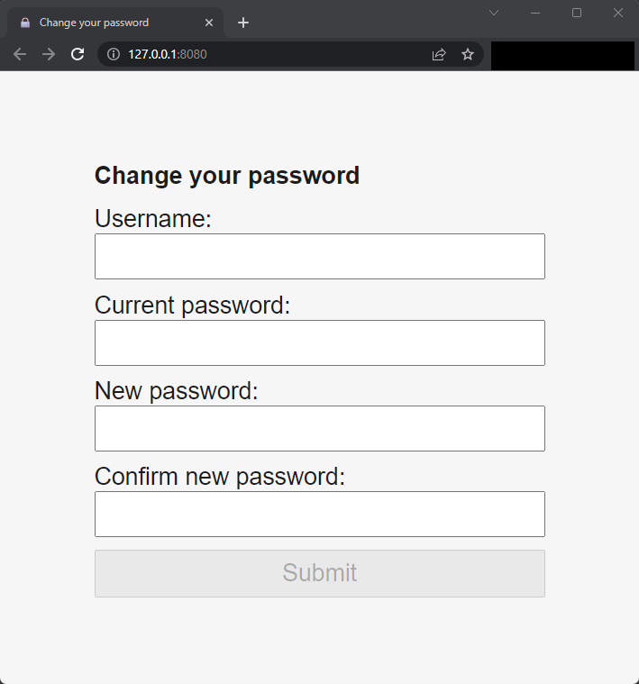
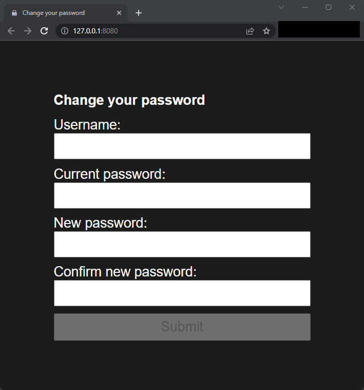
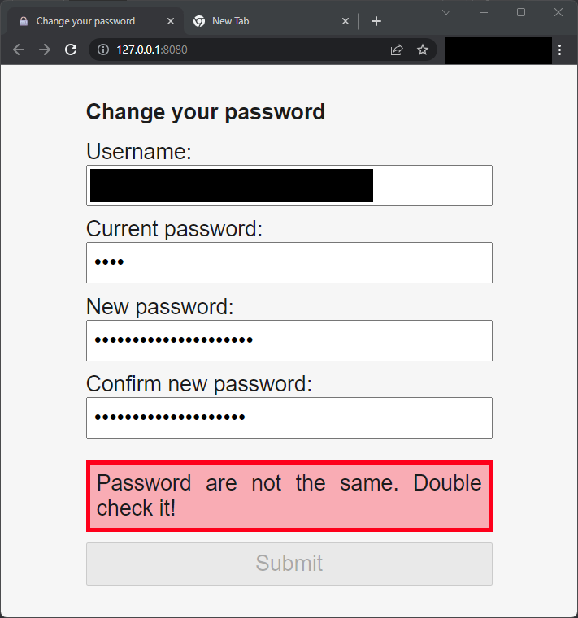
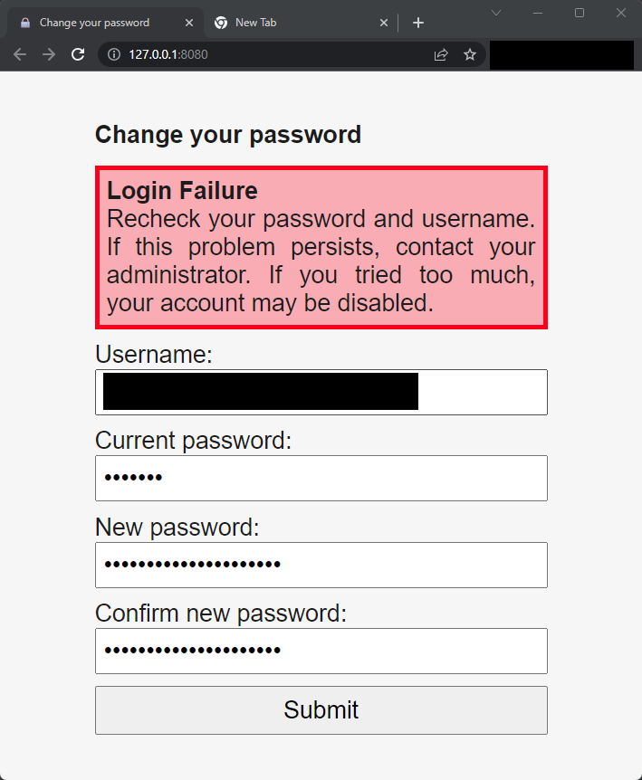
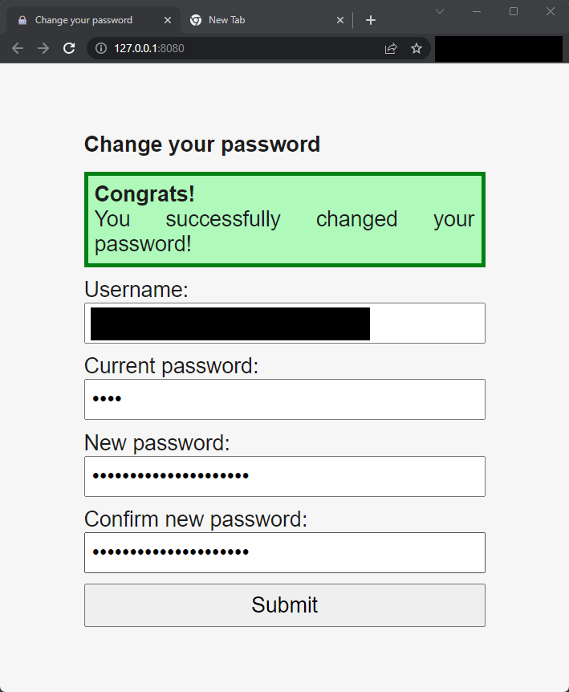

# smbpasswd-web-light

## What is it?

More than only "inspired" by [`smbpasswd-web`](https://github.com/Gurkengewuerz/smbpasswd-web), this project aims to be
a web interface to let users change their password on a remote SMB/CIFS server. Same shit as the previous project: "no
user adding, no machine account, nothing, plain simple changing a password", to make users autonomous.

The goal of this project is really to make users fully autonomous:

* No actions from the
administrator (as the stuff with token of the original project) is needed. It's also just a silly and light container to
run.
* Usage of a web browser is the ONLY requirement for users.

It's also extensible: it exposes an API.

It tries to be as safe as possible, thus, if you find a security vulnerability, do not hesitate to report it to me, and
we will see, depending on the criticism of the finding, how may I give you a reward. #BugBounty

## Sneak peek

The UI is silly and simple: just fields, nothing else. Colors are adapted to the color-scheme's device preference.

There are also some small user-side checks.

Also, error messages are displayed with details.

## How it works?

When a user needs to change his password, the user accesses the website and changes its password. Done. That's all.

## Installation

To install this software, you have to use the container. To install the container, here are the instructions:

1. Pull the docker image [`ghcr.io/ajabep/smbpasswd-web-light:main`](https://ghcr.io/ajabep/smbpasswd-web-light:main);
2. The container has to be linked to the SMB server;
3. The environment variables are to are the following.
	- `REMOTE`: (string; an IP or a domain name) The address of the remote SMB server;
	- `HOST`: (string; an IP or a domain name) The hostname that requests are supposed to use. Add the port number
	  is not standard;
	- `VERBOSE`: (Optional; positive integer) When used, the logs will be verbose;
	- `UNSAFE_DEVELOPMENT_MODE`: (Optional; string) **UNSAFE** to use only when you are developing. If the value is not
	  the right one (embedded in the entrypoint file ; case-sensitive), the dev mode will not be enabled. Please, make
	  sure this is used only in a development network and computer. This will only make this container more weak and
	  vulnerable. If you want to have some verbose log, use the `VERBOSE` variable. This option is **UNSAFE**. Do 
      **NOT** use it.
4. You HAVE to put this server BEHIND a reverse-proxy. For more info, refer to the
   [Flask documentation](https://flask.palletsprojects.com/en/2.3.x/deploying/). Your reverse proxy **HAVE** to set the
   headers `X-Forwarded-For`, `X-Forwarded-Host`. If you don't want to use them, please, clear them.

The application files are putted in the `/app` directory.

Logs are available on the STDOUT.

## TODO

Check issues and fix some of them!

## License

*smbpasswd-web-light* is released under the Unlicensed license. See the [./LICENSE](LICENSE) file.

Based on the idea (and not only the idea) of [`Gurkengewuerz's smbpasswd-web`](https://github.com/Gurkengewuerz/smbpasswd-web); App icon by [icons8](https://icons8.com/).
